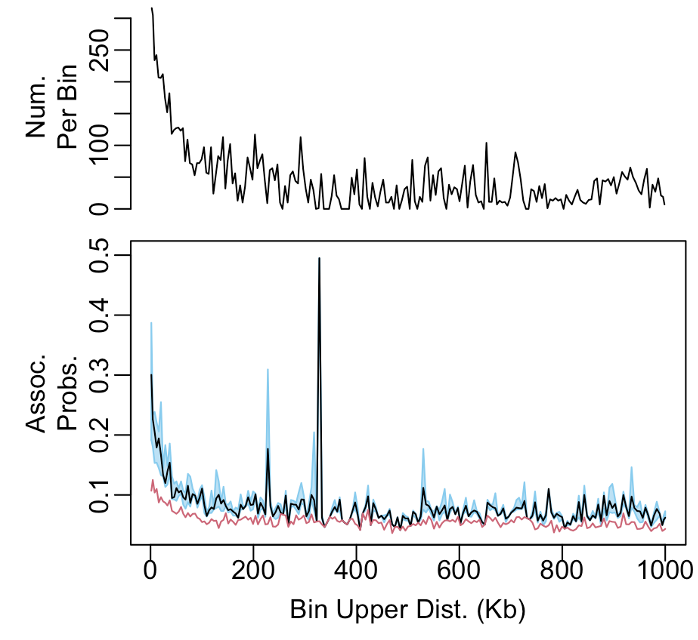
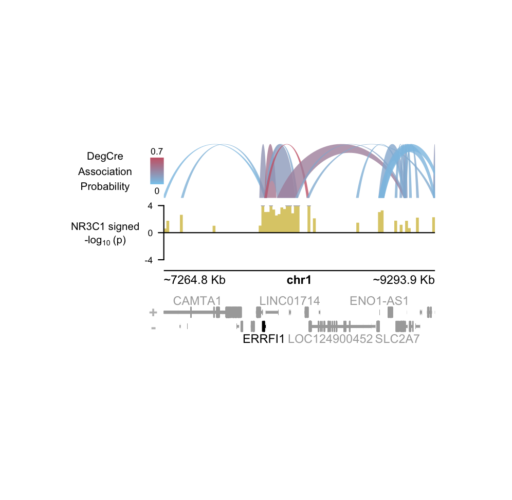

# DegCre: Probabilistic association of DEGs to CREs from differential data

## Installation

With the `devtools` pacakge installed, run:

```r
devtools::install_github("brianSroberts/DegCre")
```

## Introduction
`DegCre` associates differentially expressed genes (DEGs) with cis-regulatory elements (CREs) in a probabilistic, non-parametric approach. `DegCre` is intended to be applied on differential expression and regulatory signal data derived from responses to perturbations such as drug or natural ligand treatmnents. As an example used here, we have obtained data from McDowell et al. ([McDowell et al., 2018](https://genome.cshlp.org/content/early/2018/08/10/gr.233346.117)) which was generated by treating A549 cells with dexamethasone and measuring RNA-seq and ChIP-seq data at several time points. Data from RNA-seq and NR3C1 ChIP-seq at four hours versus control is stored in the list `DexNR3C1`.

`DegCre` uses the [GenomicRanges](https://bioconductor.org/packages/release/bioc/html/GenomicRanges.html) framework for handling genomic regions and some calculations. As one input, `DegGR`, users generate differntial expression statistics for genes with methods such as [DESeq2](https://bioconductor.org/packages/release/bioc/html/DESeq2.html) or [edgeR](https://bioconductor.org/packages/release/bioc/html/edgeR.html). These
values should then be associated with gene TSSs such as those available from [EPDNew](https://epd.expasy.org/epd/) in a `GRanges`. The second input, `CreGR`, is differential regulatory signal data (in the example, NR3C1 ChIP-seq data) associated with genomic regions in a `GRanges` such as those generated by [csaw](https://bioconductor.org/packages/release/bioc/html/csaw.html). 

A complete description of the mathematical basis of the `DegCre` core algorithms is provided in (CITE Roberts et al). `DegCre` generates a `Hits` object of all associations between `DegGR` and `CreGR` within a specified maximum distance.
Associations are then binned by TSS-to-CRE distance according to an algorithm that balances resolution (many bins with few members)
versus minimization of the deviance of each bin's CRE p-value distribution from the global distribution, selecting an optimal bin size.

Next, `DegCre` applies a non-parametric algorithm to find concordance between DEG and CRE differential effects within bins and derives an association probability.
For all association probabilities involving one given CRE, the probabilities are adjusted to favor associations across shorter distances.
An FDR of the association probability is then estimated. Results are returned in list containing a `Hits` object and both input `GRanges`.

## Examples

Generate `DegCre` associations from provided sample data `DexNR3C1` as view the results:
```r
myDegCreResList <- runDegCre(DegGR=DexNR3C1$DegGR,
		DegP=DexNR3C1$DegGR$pVal,
		DegLfc=DexNR3C1$DegGR$logFC,
		CreGR=DexNR3C1$CreGR,
		CreP=DexNR3C1$CreGR$pVal,
		CreLfc=DexNR3C1$CreGR$logFC,
		reqEffectDirConcord=TRUE,
		verbose=FALSE)

names(myDegCreResList)
head(myDegCreResList$degCreHits)
```
Next plot the association probability versus distance:


```r
binStats <- plotDegCreAssocProbVsDist(degCreResList=myDegCreResList,
                                      assocProbFDRThresh=0.05)
```

We can plot a gene of interest browser view using [plotgardner](https://bioconductor.org/packages/release/bioc/html/plotgardener.html) functionality:


```r
browserOuts <- plotBrowserDegCre(degCreResList=myDegCreResList,
                                 geneName="ERRFI1",
                                 geneNameColName="GeneSymb",
                                 CreSignalName="NR3C1",
                                 plotWidth=3.5,
                                 plotHeight=2)
```
